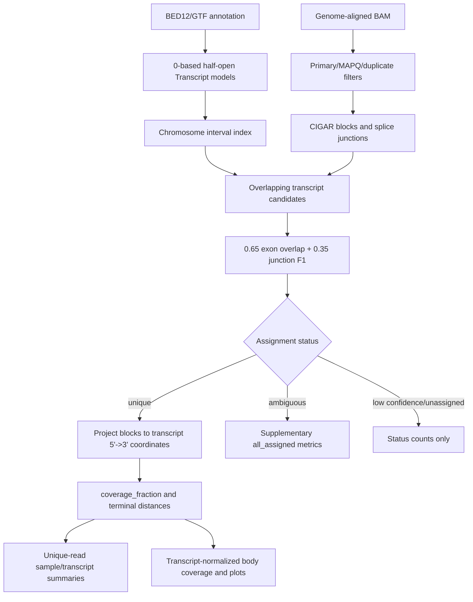

# IsoComp 全流程逻辑复核

## 资料来源

- 当前仓库代码、README、测试和 synthetic truth benchmark。
- `CITATION.cff` 提到 associated manuscript，但版本控制中的资料没有论文 DOI、预印本或正式方法文章。
- 本次外部检索因搜索服务返回 HTTP 403 未取得可核验论文，因此以下结论是代码级审查，不把尚未发表的方法主张当成外部验证结果。

## 总结结论

IsoComp 的主流程适合作为“注释相对的、read-centric 长读长转录本完整性 QC”：先把每条可用 read 分配到最匹配的注释 transcript，再在该 transcript 的 5'->3' 坐标中计算覆盖比例和两端距离。这个顺序合理，也确实避免了把所有未表达 transcript 模型直接重复计入 metatranscript coverage。

它不能直接证明一条分子到达了真实生物学 TSS 或 poly(A)/TES。当前结果准确表达的是：read 的基因组比对是否到达最佳匹配注释 transcript 的外显子端点。注释端点误差、isoform ambiguity、接头误比对和 strand 不确定性都会影响解释。

## 端到端流程



## 分层审查

### 1. 注释和坐标

合理部分：

- BED12 按 0-based half-open 读取；GTF exon 从 1-based closed 转为 0-based half-open。
- exon 重叠被拒绝，避免同一 genomic base 映射到多个 transcript 位置。
- 负链 exon 按转录方向反转，内部 transcript 坐标始终为 5'->3'。
- TSS/TES 使用每个 transcript 最外侧 exon 边界，不混用 gene 边界。

当前处理：

- strand 为 `.` 的 transcript 仍可参与 assignment 和 orientation-independent coverage fraction，但不再输出 5'/3' terminal metrics，也不进入有方向的 transcript body coverage。terminal fractions 使用单独的 evaluable-read 分母。

### 2. BAM 和 CIGAR

合理部分：

- BAM 流式读取，不要求索引。
- 默认排除 unmapped、secondary、supplementary、duplicate、低 MAPQ 和空比对。
- CIGAR `N` 转为 splice junction；插入和 soft clip 不计入参考覆盖；deletion 不被错误算作已覆盖碱基。
- soft clip 根据 transcript strand 转换为 transcript 5'/3' 端。

限制：

- `read_aligned_length` 实际是参考基因组上的匹配/错配 footprint，不包含 insertion，也不是完整 query aligned length。
- poly(A) 和固定接头若为 soft clip，不参与 TES 判断；若被 aligner 错误纳入 `M/=/X`，可能改变端点和 exon-overlap score。

### 3. 候选 transcript

合理部分：

- 先按 transcript genomic span 建 interval index，再计算真实 exonic overlap，避免逐 read 扫描全部注释。
- `min_overlap` 排除只有很短偶然重叠的模型。

当前处理和限制：

- `strandness=auto` 现在先抽查最多 100,000 条 usable reads，跳过反义候选混合的位点并进行样本级 forward/reverse 投票；至少 100 条 informative reads 且优势比例不低于 80% 时才解析方向，否则明确回退为 unstranded。requested/resolved strandness 和投票统计写入 JSON。
- BAM 与 annotation chromosome 完全不相交时现在会在分析前报错；部分 annotation references 缺失时记录 warning。

### 4. Isoform assignment

当前公式：

```text
exon_overlap_score = transcript-exonic aligned bases / read reference-aligned bases
junction_score = harmonic_mean(junction precision, junction recall)
final_score = 0.65 * exon_overlap_score + 0.35 * junction_score
```

合理部分：

- assignment 与 completeness 分离，截短但 splice chain 合理的 read 不会仅因未到达端点而降低 assignment score。
- `unique/ambiguous/low_confidence/unassigned` 状态边界清楚。
- 无剪接 read 落在多外显子 transcript 时有最低 20% transcript coverage guard，减少短共享 exon 片段被当作 isoform-level unique evidence。
- ambiguous 和 low-confidence reads 不进入默认 transcript body coverage。

限制：

- 这是规则型 MVP，不是完整 exon-chain probabilistic model。MAPQ、soft clip、较大 insertion、terminal anchor 长度和 annotation prior 不参与评分。
- 单外显子 transcript 上的短 read 只要 read 本身大部分落在 exon 内，仍可能获得高分；它可以用于 completeness QC，但 isoform 身份证据较弱。
- `unique_threshold`、`margin_threshold` 和 full-length coverage 已作为正式 CLI 参数暴露并写入 JSON。

### 5. Transcript projection 和 TSS/TES

确定 transcript 后，read blocks 与 transcript exons 相交并投影：

```text
read_start_tx = minimum projected start
read_end_tx = maximum projected end
dist_to_5p = read_start_tx
dist_to_3p = transcript_length - read_end_tx
```

默认判断：

```text
is_5p_complete = dist_to_5p <= tss_tol
is_3p_complete = dist_to_3p <= tes_tol
is_full_length_like = unique and coverage_fraction >= 0.8
                      and is_5p_complete and is_3p_complete
```

逻辑本身对正负链一致。terminal call 现在还要求容差窗口延伸区内至少有 `--min-terminal-anchor` 个投影碱基（默认 10 bp），避免仅靠 1--2 bp 偶然触端判完整；设为 0 可恢复旧行为。

### 6. 汇总分母

- 默认 `5p_complete_fraction`、`3p_complete_fraction`、`full_length_like_fraction` 的分母均为 IsoComp `unique` reads。
- `all_assigned_*` 的分母为 `unique + ambiguous`。
- transcript-level coverage、terminal metrics 和 body coverage 默认只使用 unique reads。
- 因此这些指标是“可唯一分配 reads 条件下的完整率”，不是全部 primary reads 或全部分子的完整率。高 isoform ambiguity 数据中应同时报告 unique/primary、ambiguous/assigned 等比例。

### 7. 流式统计和绘图

合理部分：

- read-level TSV 流式写出。
- sample-level mean、counts 和 fractions 在线累计。
- 超过 100,000 条后的 sample median 使用 P2 流式估计；此前发现的尾部缓存错误已修复。
- 距离图使用 reservoir sample，横轴按第 95 百分位和约 2 kb soft cap 收束，超长值汇入最后一个 bin。

当前处理和剩余限制：

- transcript-level median 改为从第一条 observation 开始使用常量内存 P2 estimator；transcript accumulators 和 body arrays 只在出现 assignment/unique directional evidence 时稀疏创建。
- metadata 同时记录 requested/resolved annotation format 和 strandness。
- sample summary 直接写出 usable、duplicate、low-MAPQ、empty-alignment 和 terminal-evaluable counts。
- 注释模型和 interval index 本身仍必须常驻内存，这是当前设计的基础成本。

## 验证结果

- `pytest`: 47 tests passed。
- synthetic CLI end-to-end: passed。
- 精简 synthetic truth benchmark：`status_accuracy=1.0`、`unique_transcript_accuracy=1.0`、`full_length_f1=1.0`。
- synthetic benchmark 证明实现与内置真值规则一致，但场景规模较小且由相同方法假设生成，不能替代 SIRV、cap/poly(A)-anchored truth 或人工核验真实 reads。

## 优先级建议

1. 评估 poly(A)/adapter-aware TES 证据，而不是只依赖 genomic endpoint。
2. 用真实标准品和不同 annotation 版本验证端点准确性及 unique-read selection bias。

## 最终判断

作为 alpha/MVP 的 annotation-relative completeness QC，主流程合理，可以使用。本轮已修正未知链 terminal 指标、样本级 auto strandness、流式中位数、稀疏内存、阈值参数、端点 anchor 和运行元数据。用于论文中的绝对“全长分子捕获率”结论时，仍必须把 unique-read 条件分母、annotation-relative TSS/TES 和 adapter/poly(A) 限制写清楚，并补充真实标准品验证。
